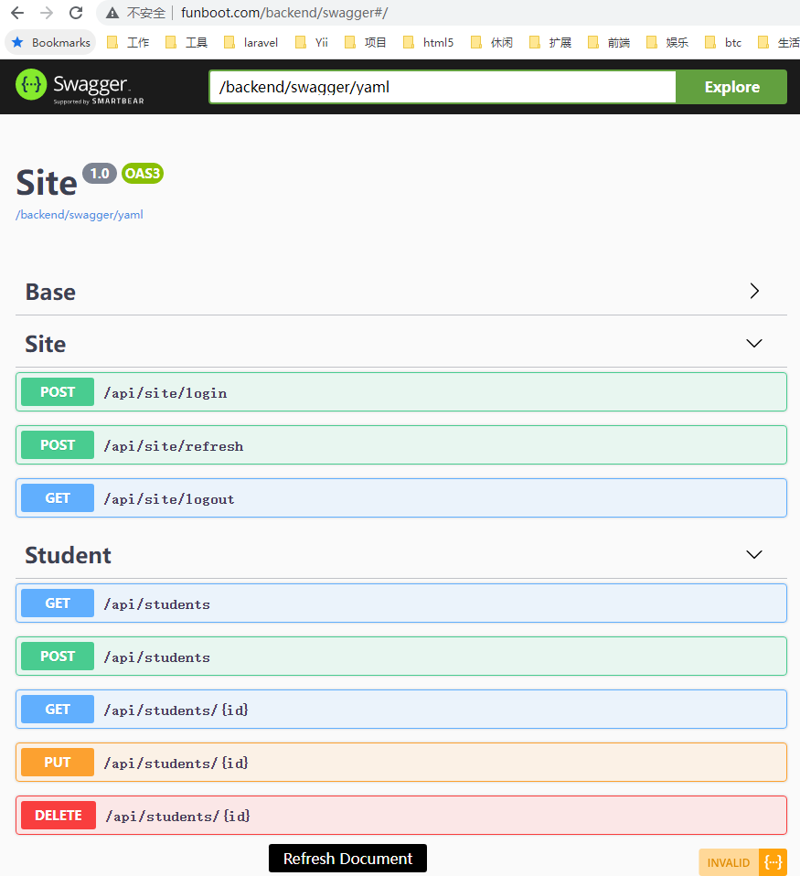
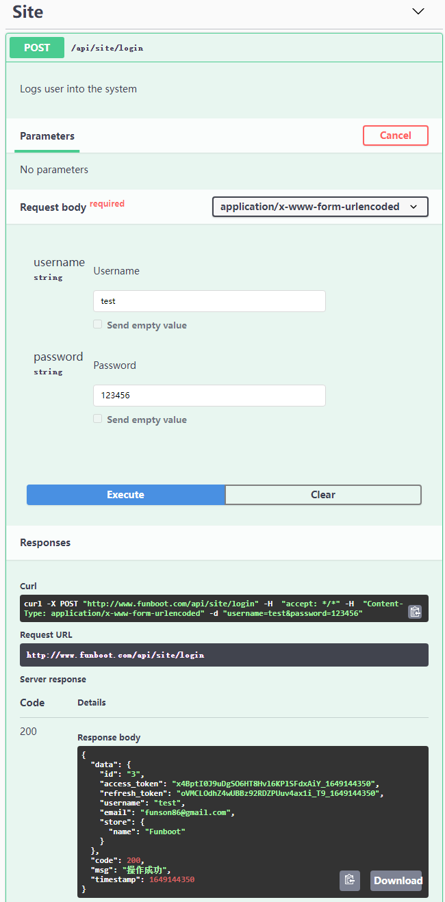
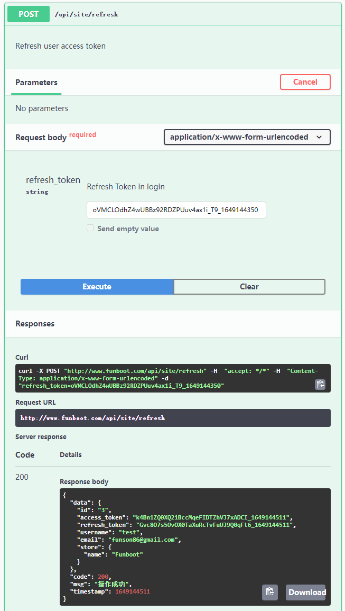
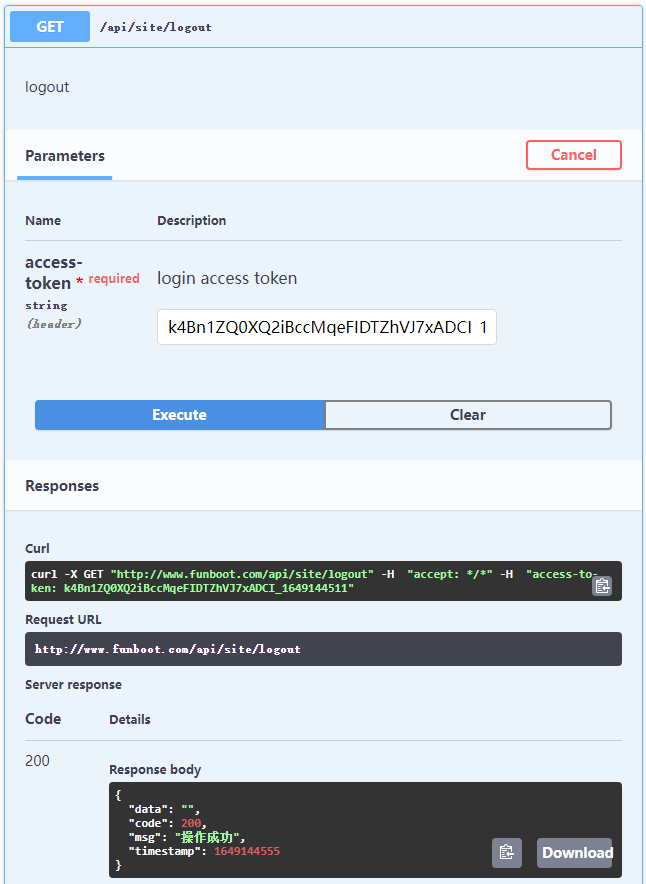

Swagger自动生成Api文档
-------

使用[Swagger](https://swagger.io)

```
/backend/swagger/refresh
```




> 点击底部的 Refresh Document按钮或者 访问 /backend/swagger/refresh 来刷新Swagger文档

### 修改新项目扫描路径

在 backend/config/params-local.php 中添加修改

```php
    'swaggerScanPath' => [
        '@api/modules/v1/controllers',
    ],
```

> 扫描路径中只允许出现一次 @OA\Info(title="Site", version="1.0")

### Swagger注释格式

可以参考 api/controllers/StudentController.php 或者 api/controllers/BaseController.php 文件，Swagger的Restful接口写法如下

```php
    /**
     * @OA\Get(
     *     path="/api/students",
     *     tags={"Student"},
     *     summary="List records",
     *     description="list ?page=2 pagination ?name='funson&created_at=>1648607050 search",
     *     @OA\Response(response="200", description="Success")
     * )
     */

    /**
     * @OA\Get(
     *     path="/api/students/{id}",
     *     tags={"Student"},
     *     summary="view one record",
     *     description="view one record",
     *     @OA\Parameter(name="id", required=true, @OA\Schema(type="string"), in="path", description="id"),
     *     @OA\Response(response="200", description="Success")
     * )
     */

    /**
     * @OA\Post(
     *     path="/api/students",
     *     tags={"Student"},
     *     summary="create a new record",
     *     description="create a new record",
     *     @OA\RequestBody(
     *       required=true,
     *       @OA\MediaType(
     *           mediaType="application/x-www-form-urlencoded",
     *           @OA\Schema(
     *               type="object",
     *               @OA\Property(property="name", type="string", description="Name"),
     *           )
     *       )
     *     ),
     *     @OA\Response(response="200", description="Success")
     * )
     */

    /**
     * @OA\Put(
     *     path="/api/students/{id}",
     *     tags={"Student"},
     *     summary="update a record",
     *     description="update a record",
     *     @OA\Parameter(name="id", required=true, @OA\Schema(type="string"), in="path", description="id"),
     *     @OA\RequestBody(
     *       required=true,
     *       @OA\MediaType(
     *           mediaType="application/x-www-form-urlencoded",
     *           @OA\Schema(
     *               type="object",
     *               @OA\Property(property="name", type="string", description="Name"),
     *           )
     *       )
     *     ),
     *     @OA\Response(response="200", description="Success")
     * )
     */

    /**
     * @OA\Delete(
     *     path="/api/students/{id}",
     *     tags={"Student"},
     *     summary="delete a record",
     *     description="delete a record",
     *     @OA\Parameter(name="id", required=true, @OA\Schema(type="string"), in="path", description="id"),
     *     @OA\Response(response="200", description="Success")
     * )
     */
```

### 运行参考

- 登录



- 刷新Token

 

- 注销



- 列表


### 参考

- https://github.com/zircote/swagger-php/tree/master/Examples/petstore.swagger.io/Controllers   参考该项目中的 Swagger写法
- https://petstore.swagger.io Swagger效果演示
