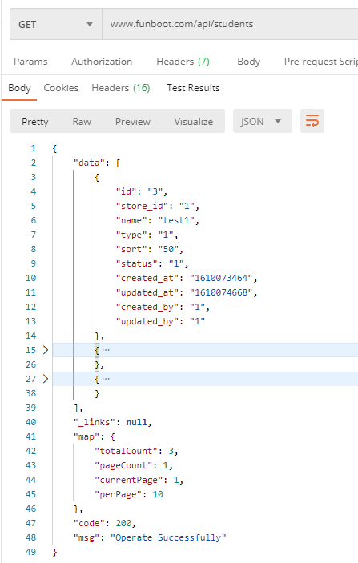
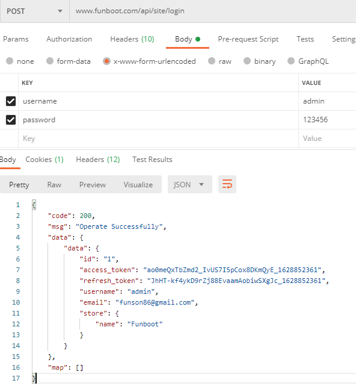
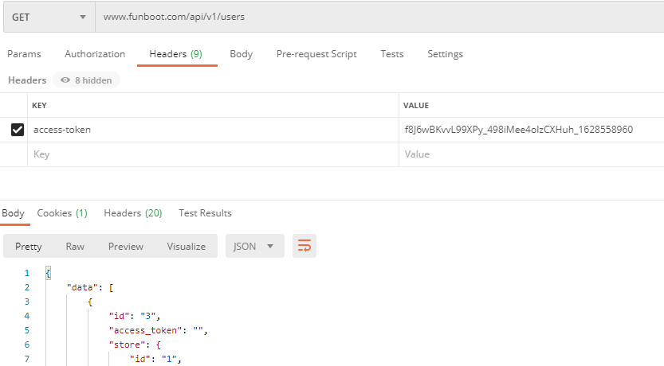
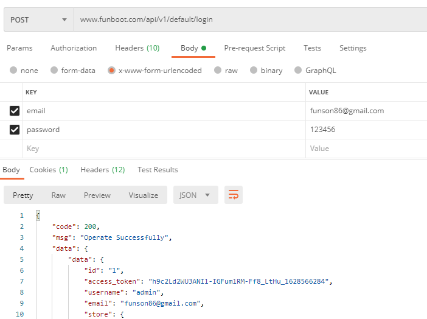

Api
-------


### 模块规划

- v1 app通用接口，支持相同接口不同版本
- v2 app通用接口，支持相同接口不同版本
- mini 微信小程序api目录
- xx 其他自定义模块接口


### 自定义返回格式

继承api/components/response/ResponseAbstract


### RESTFUL方法
 
|  #   | Method  | URL  | 说明  |
|  ----  | ----  |  ---- |  ---- |
| 列表  | GET | /api/students | 获取列表 |
| 查看  | GET | /api/students/1 | 单个 |
| 创建  | POST | /api/students | 新建，www-form-urlencoded |
| 更新  | PUT | /api/students/1 | 更新，www-form-urlencoded |
| 删除  | DELETE | /api/students/1 | 删除单个 |





- 需要在api/config/main.php中配置支持rest的controller (注意如果common/config/main.php中配置了urlManager可能会冲突)

```
        'urlManager' => [
            ...
            'rules' => [
                [
                    'class' => 'yii\rest\UrlRule',
                    'controller' => [
                        'student',
                        'v1/user',
                    ]
                ],
            ],
        ],
```

### 权限控制

通过SiteController中actionLogin登录获取access_token



默认的api/controller/BaseController支持的方法index, view, create, update, delete都需要提供access-token，注意返回的是access_token



如果函数不需要鉴权，在controller中的optionalAuth变量中写入action id

```php
    public $optionalAuth = ['index', 'login', 'logout'];
```

- 如果需要RBAC鉴权或其他方式，在api/controller/BaseController中覆盖checkAccess函数


- 其他方式登录可以参考v1/controller/DefaultController中的actionLogin



### 频率限制

使用yii\filters\RateLimiter来控制，在params.php中

```php
    //速率限制，如 100s 内 20 次，可以在param.php中设置频率
    'rateLimit' => 20,
    'timeLimit' => 100,
```

也可以修改api/models/User.php中变量

```php
    //速率限制，如 100s 内 20 次，可以在param.php中设置频率
    public $rateLimit = 20;
    public $timeLimit = 100;

```

### 字段控制

如果不需要的字段，可以通过fields()和extraFields()来控制，在extraFields中的Model中要有对应的getXxx函数，如api/models/User.php

```php
class User extends \common\models\User implements RateLimitInterface
{
    public function fields()
    {
        return ['id', 'access_token', 'store'];
    }

    public function extraFields()
    {
        return ['store'];
    }
}
```


### 参考

- https://github.com/yiisoft/yii2/blob/master/docs/guide-zh-CN/rest-quick-start.md
