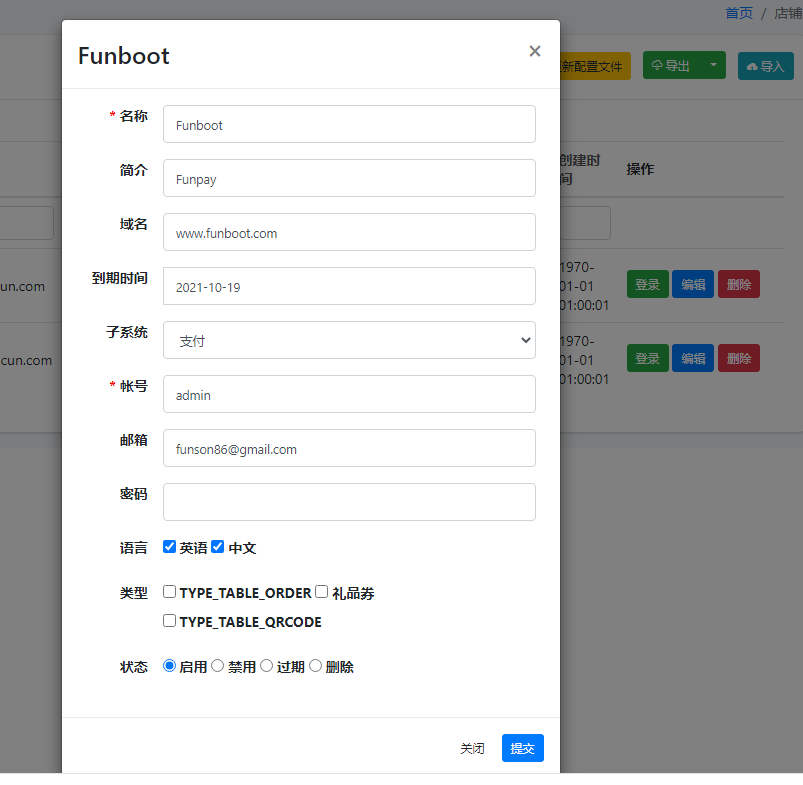

系统安装
-------

目录

- 系统环境要求
- 系统安装
- 系统配置
- 系统运行 & 体验
- 常见问题


### 系统环境要求

> 详细请查看[系统环境](start-env.md)，快速运行环境推荐[宝塔面板](https://www.bt.cn/)

- PHP >= 7.3
- Mysql建议5.7.x
- [Composer](https://getcomposer.org/download/)

### 系统安装

1、Git克隆代码，或者直接下载[Funboot代码Zip包](https://github.com/funson86/funboot/archive/master.zip)

```
git clone https://github.com/funson86/funboot funboot
```

2、进入funboot目录，如果直接下载代码包改名字并从控制台进入目录

```
cd funboot
```

3、安装系统依赖

```
composer install 
```

4、初始化项目

``` 
php init // 然后输入0选择开发模式回车,再输入yes回车
```

5、配置数据库信息（Mysql5.7.x，需要先创建好数据库）

common/config/main-local.php 修改数据库相关信息

``` 
        'db' => [
            'class' => 'yii\db\Connection',
            'dsn' => 'mysql:host=localhost;dbname=funboot',
            'username' => 'root',
            'password' => '',
            'charset' => 'utf8mb4',
            'tablePrefix' => 'fb_',
            // 'enableSchemaCache' => true, // 是否开启缓存, 请了解其中机制在开启，不了解谨慎
            // 'schemaCacheDuration' => 3600, // 缓存时间
            // 'schemaCache' => 'cache', // 缓存名称
        ],
```

6、导入数据库数据

``` 
php yii migrate/up
```

以上导入的为基础版的funboot开发平台

其他子系统的执行脚本

```
php yii migrate-pay/up  // 支付
php yii migrate-cms/up  // CMS网站
php yii migrate-bbs/up  // 论坛
php yii migrate-mall/up  // 商城
php yii migrate-chat/up  // 聊天室
```

### 系统配置

> 以下为Nginx下的配置，Apache的伪静态已经在系统.htaccess中配置好

Nginx在配置文件中将目录指向 /path/to/funboot/web ，然后设置好伪静态

以下为主要配置供参考

```
server
    {
        listen 80;
        server_name www.funboot.com;
        index index.html index.htm index.php default.html default.htm default.php;
        root  /path/to/funboot/web;
    
        # 伪静态配置
        location / {
            # Redirect everything that isn't a real file to index.php
            try_files $uri $uri/ /index.php$is_args$args;
        }
        location /backend {
            try_files $uri $uri/ /backend/index.php$is_args$args;
        }
        location /api {
            try_files $uri $uri/ /api/index.php$is_args$args;
        }

        location ~ \.php$ {
            include fastcgi_params;
            fastcgi_param SCRIPT_FILENAME $document_root$fastcgi_script_name;
            fastcgi_pass 127.0.0.1:9000;
            #fastcgi_pass unix:/var/run/php5-fpm.sock;
            try_files $uri =404;
        }
    }
```

### 系统运行

在hosts文件中的www.funboot.com指向127.0.0.1

使用浏览器通过如下 URL 访问刚安装完的 Yii 应用了：

```
http://www.funboot.com/  前端
http://www.funboot.com/backend  后台  默认帐号：admin 密码：123456
http://www.funboot.com/api api
```

> http://www.funboot.com/ 默认页面是和Yii2原本类似的页面，在系统后台》系统管理》店铺管理，对域名www.funboot.com编辑，修改子系统为支付
> 刷新前端页面，系统会默认显示成FunPay个人收款支付系统https://funpay.funboot.net/



### Crontab Shell脚本 & 定时任务

系统内置的shell脚本在 console/shell/ 目录中

- queue.sh 监控队列
- mysqlbackup.sh 备份数据库

建议拷贝queue.sh为queue-local.sh，写入到crontab中。

定时任务：

```
/usr/bin/php /www/funboot/yii schedule/run --scheduleFile=/www/funboot/console/runtime/schedule/schedule.php  1>> /dev/null 2>&1
```

### 常见问题

请参考[常见问题](start-faq.md)


