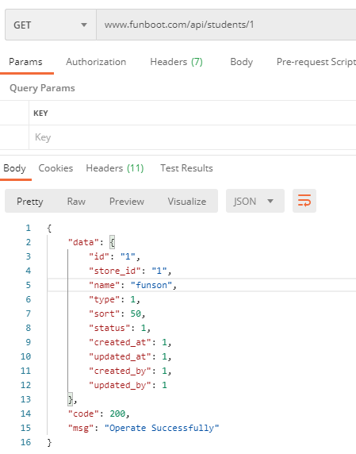
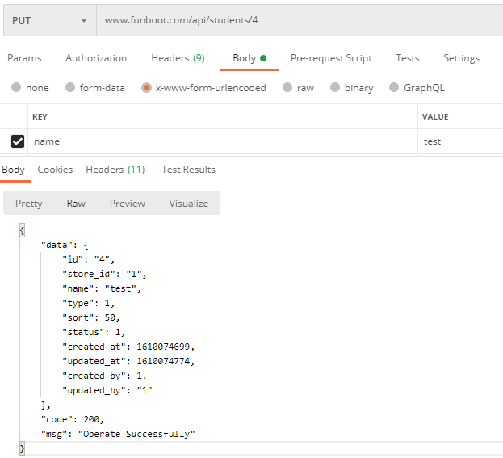
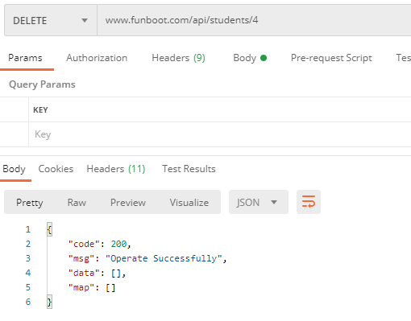
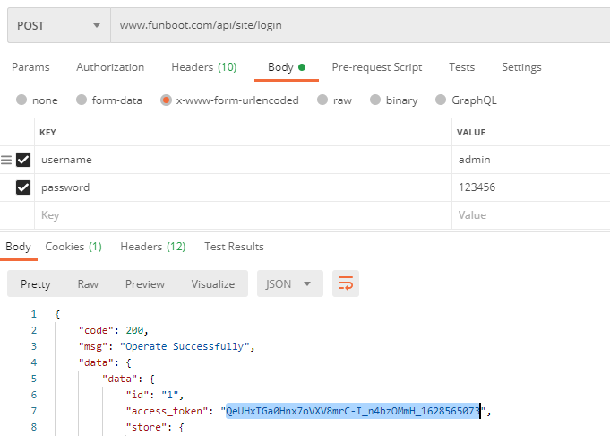
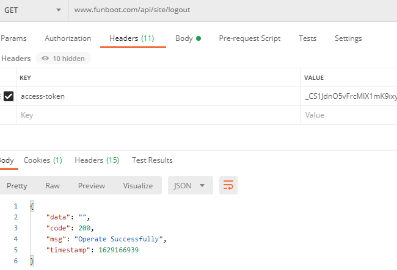

Api
-------


### Module Plan

- v1 app common api, support same api with different version
- v2 app common api, support same api with different version
- mini Wechat mini program directory
- xx other self defined module api


### Custom Response Format

Inherit api/components/response/ResponseAbstract


### RESTFUL Method
 
|  #   | Method  | URL  | Desc  |
|  ----  | ----  |  ---- |  ---- |
| List  | GET | /api/students | get list |
| View  | GET | /api/students/1 | view one |
| Create  | POST | /api/students | creation, www-form-urlencoded |
| Update  | PUT | /api/students/1 | update one, www-form-urlencoded |
| Delete  | DELETE | /api/students/1 | Delete one |









- Config api/config/main.php to support rest controller (Note may conflict while config in common/config/main.php)

```
        'urlManager' => [
            ...
            'rules' => [
                [
                    'class' => 'yii\rest\UrlRule',
                    'controller' => [
                        'student',
                        'v1/user',
                    ]
                ],
            ],
        ],
```

### Auth Control

Get access_token in SiteController actionLogin



The index, view, create, update, delete in api/controller/BaseController need access-token，note not access_token

![]

If the function does not need auth, fill the action id in optionalAuth array in controller

```php
    public $optionalAuth = ['index', 'login', 'logout'];
```

Refresh the access_token by using refresh_token


- Logout



- In need RBAC auth or other，overide checkAccess function in api/controller/BaseController

- Other login way can refer to actionLogin in v1/controller/DefaultController


### Rate limit

use yii\filters\RateLimiter to control rate limit，in params.php

```php
    //rate limit，eg 20 times in 100 seconds，config in params.php
    'rateLimit' => 20,
    'timeLimit' => 100,
```

You can config in api/models/User.php also.

```php
    //rate limit，eg 20 times in 100 seconds，
    public $rateLimit = 20;
    public $timeLimit = 100;

```

### Field Control

In you don't need some fields to client， config fields() and extraFields(), in extraFields of correspond Model getXxx function，eg: api/models/User.php

```php
class User extends \common\models\User implements RateLimitInterface
{
    public function fields()
    {
        return ['id', 'access_token', 'store'];
    }

    public function extraFields()
    {
        return ['store'];
    }
}
```


### References

- https://github.com/yiisoft/yii2/blob/master/docs/guide-zh-CN/rest-quick-start.md
