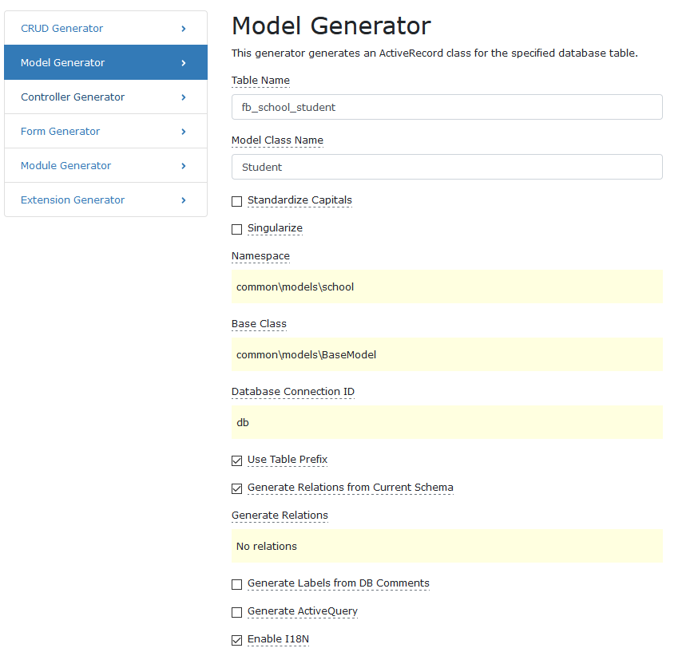
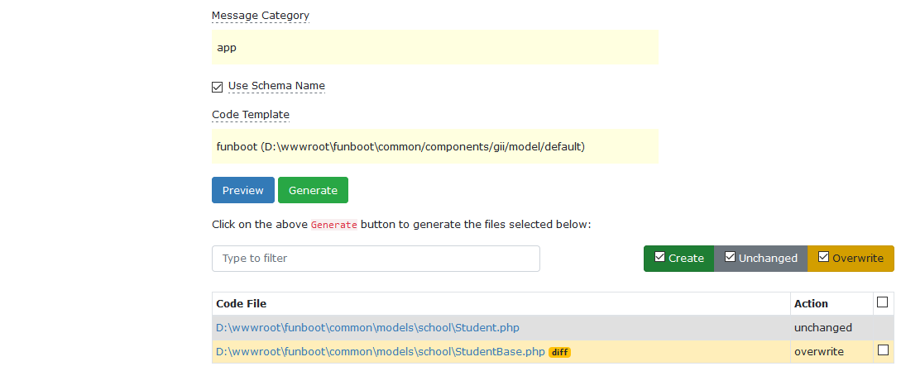
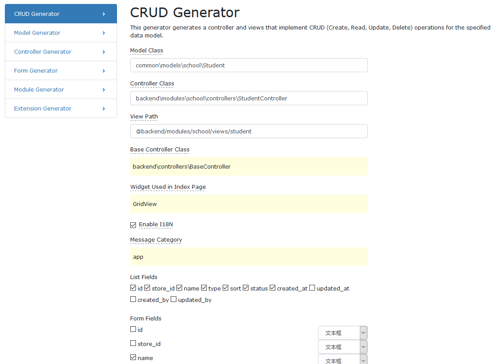
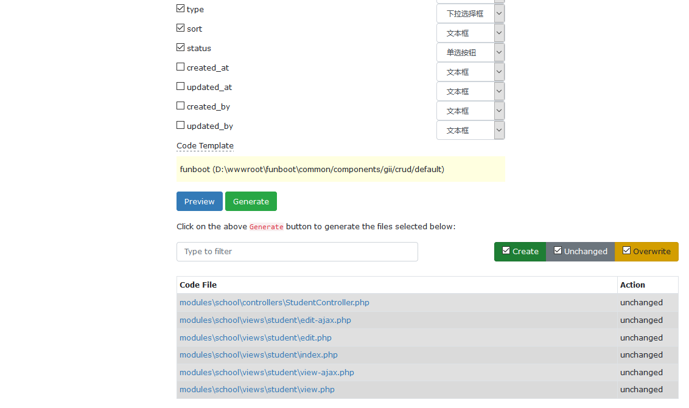
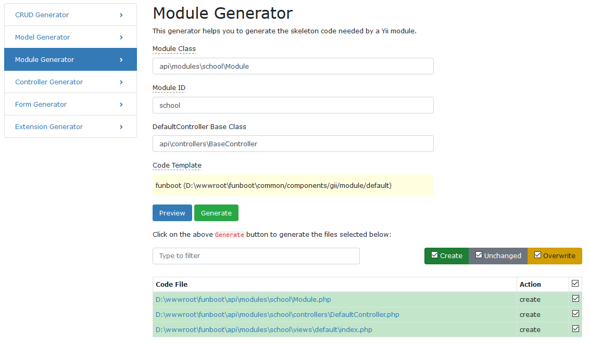

Gii
-------

目录

- Gii配置
- model
- 修改表结构后无限制生成model
- crud
- module

### Gii配置

在backend/config/main-local中添加以下代码启动funboot代码模版

```php
    $config['bootstrap'][] = 'gii';
    $config['modules']['gii'] = [
        'class' => 'yii\gii\Module',
        'generators' => [
            'crud' => [
                'class' => \common\components\gii\crud\Generator::className(),
                'templates' => [
                    'funboot' => '@common/components/gii/crud/default',
                    'default' => '@vendor/yiisoft/yii2-gii/src/generators/crud/default',
                ]
            ],
            'model' => [
                'class' => \common\components\gii\model\Generator::className(),
                'templates' => [
                    'funboot' => '@common/components/gii/model/default',
                    'default' => '@vendor/yiisoft/yii2-gii/src/generators/crud/default',
                ]
            ]
        ],
    ];
```

### model
``` 
Table Name: fb_school_student
Model Class Name: Student
Namespace: common\models\school
Base Class: common\models\BaseModel
勾选 Use Table Prefix
不勾选 Generate Labels from DB Comments【在ModelBase中会生成带英文版，在Model生成中文注释的，如果需要英文版，则去掉Model中的attributeLabels()方法】
勾选 Generate Relations from Current Schema
勾选 Enable I18N
```




### 修改表结构后无限制生成model

- 有外键时生成外键相关代码移到modelBase中，包括rules和getRelation函数
- 删除数据库外键
- 生成时选择no relation
- 线上数据库删除外键限制

- 或者先选择no relation方式，再选择All relations将生成的model中多出的代码拷贝到modelBase中


### crud
```
Model Class: common\models\school\Student
Controller Class: backend\modules\school\controllers\StudentController
View Path: @backend/modules/school/views/student
Base Controller Class: backend\controllers\BaseController
勾选 Enable I18N
勾选 Code Template: funboot
```




### module
``` 
Module Class: backend\modules\school\Module
Module ID: school
DefaultController Base Class: backend\controllers\BaseController
Code Template: funboot
```


api下

