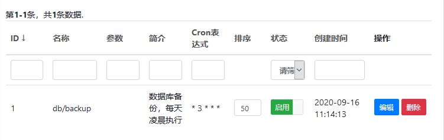

Schedule Task
-----------

> Note: In linux, the system function must be enable in php.ini


Funboot support add scheduling task in the backend. There is a database backup task executing at 3:00 am every day by default.




Add code below in crontab

```
* * * * * php /www/funboot/yii yii schedule/run --scheduleFile=/www/funboot/runtime/schedule/schedule.php 1>> /dev/null 2>&1
```


The schedule file can be changed in common/config/params.php. It should be changed in crontab both.
```php
    // file path of schedule task
    'scheduleFile' => '@console/runtime/schedule/schedule.php',
```


```
Linux
*    *    *    *    *    *
-    -    -    -    -    -
|    |    |    |    |    |
|    |    |    |    |    + year [可选]
|    |    |    |    +----- day of week (0 - 7) (Sunday=0 or 7)
|    |    |    +---------- month (1 - 12)
|    |    +--------------- day of month (1 - 31)
|    +-------------------- hour (0 - 23) 
+------------------------- min (0 - 59)
```


### References

- [yii2-scheduling](https://github.com/omnilight/yii2-scheduling): Schedule Task
