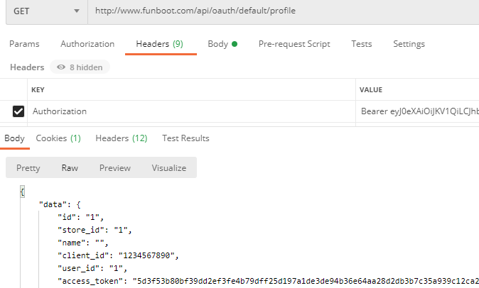
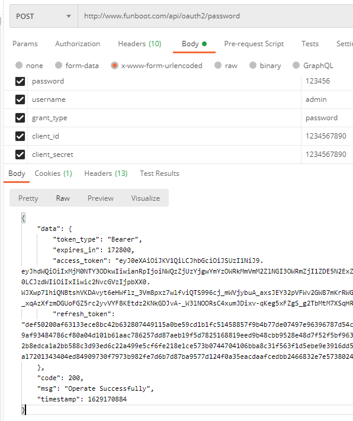
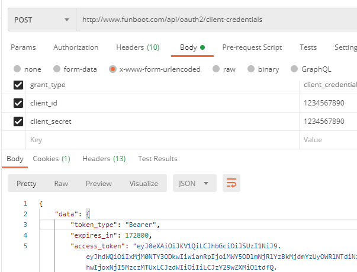
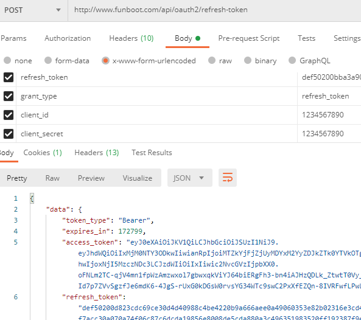

OAUTH 2.0
-----

OAUTH 2.0用于处理不同系统之间的鉴权方式，本系统支持给第三方系统授权并支持4种模式。


### 授权成功后访问数据

GET方式

``` 
/api/oauth/default/profile
```

Header 参数

参数名 | 参数类型 | 必填 | 默认 | 说明 | 备注
---|---|---|---|---|---
Authorization | string| 是 | 无 | Bearer + 空格 + access_token |




### authorization code 授权码模式

授权码模式最常用，第三方系统跳转到本系统，输入用户帐号密码（其他鉴权方式也可以），再跳转到地方系统会返回code参数。

第三方系统服务器拿到code参数直接通过服务器对服务器方式将code传给本系统，本系统会返回Access Token给第三方服务器，后续第三方服务器可以根据该Access Token获取本系统的相关数据。

Step 1. 获取Code

浏览器跳转到

GET方式

```
/auth2/authorize-code
```

Params 参数

参数名 | 参数类型 | 必填 | 默认 | 说明 | 备注
---|---|---|---|---|---
response_type | string| 是 | 无 | 固定填写 code |
client_id | string| 是 | 无 | 客户端标识 | 
redirect_uri | string| 否 | 无 | 回调跳转Url | 如果不填写者默认调用系统内填写的授权Url
state | string| 否 | 无 | CSRF令牌 | CSRF令牌的值存储在用户会话中，以便在他们返回时进行验证

如果client_id有效，会展现登录界面，输入账号密码后，会回调redirect_uri字段并带上code。


Step 2. 获取Access Token

POST方式

```
/api/auth2/authorize-code
```

Body 参数

参数名 | 参数类型 | 必填 | 默认 | 说明 | 备注
---|---|---|---|---|---
grant_type | string| 是 | 无 | 固定填写 authorization_code |
client_id | string| 是 | 无 | 客户端标识 | 
client_secret | string| 是 | 无 | 客户端秘钥 | 
redirect_uri | string| 是 | 无 | 授权Url |
code | string| 是 | 无 | 授权回调code | 


### implicit(隐藏模式)

适用于第三方系统没有后台的情况，直接从前台过来获取授权

GET方式

```
/auth2/implicit
```

Params 参数

参数名 | 参数类型 | 必填 | 默认 | 说明 | 备注
---|---|---|---|---|---
response_type | string| 是 | 无 | 固定填写 token |
client_id | string| 是 | 无 | 客户端标识 | 
redirect_uri | string| 否 | 无 | 回调跳转Url | 如果不填写者默认调用系统内填写的授权Url
scope | string| 否 | 无 | 授权获取信息类型 |
state | string| 否 | 无 | CSRF令牌 | CSRF令牌的值存储在用户会话中，以便在他们返回时进行验证


### 密码模式

高度信任环境下提供用户的账号和密码

POST方式

```
/api/auth2/password
```

Body 参数

参数名 | 参数类型 | 必填 | 默认 | 说明 | 备注
---|---|---|---|---|---
grant_type | string| 是 | 无 | 固定填写 password |
client_id | string| 是 | 无 | 客户端标识 | 
client_secret | string| 是 | 无 | 客户端秘钥 | 
username | string| 是 | 无 | 账号 | 
password | string| 是 | 无 | 密码 | 
scope | string| 否 | 无 | 授权获取信息类型 |




### 凭证式

适用于简单的第三方服务器对本服务器的获取情况，无需前端用户干预

POST方式

```
/oauth2/client-credentials
```

Body 参数

参数名 | 参数类型 | 必填 | 默认 | 说明 | 备注
---|---|---|---|---|---
grant_type | string| 是 | 无 | 固定填写 client_credentials |
client_id | string| 是 | 无 | 客户端标识 | 
client_secret | string| 是 | 无 | 客户端秘钥 | 
scope | string| 否 | 无 | 授权获取信息类型 |




### refresh-token 刷新Token

POST方式

```
/oauth2/refresh-token
```

Body 参数

参数名 | 参数类型 | 必填 | 默认 | 说明 | 备注
---|---|---|---|---|---
grant_type | string| 是 | 无 | 固定填写 refresh_token |
refresh_token | string| 是 | 无 | 重置令牌 | 
client_id | string| 是 | 无 | 客户端标识 | 
client_secret | string| 是 | 无 | 客户端秘钥 | 
scope | string| 否 | 无 | 授权获取信息类型 |



### 服务端公私钥生成方法

```
# openssl genrsa -out rsa_private_key.pem 1024
# openssl rsa -in rsa_private_key.pem -pubout -out rsa_public_key.pem
```

### 参考

- [RFC 6749](https://tools.ietf.org/html/rfc6749)
- [oauth2 server](https://github.com/thephpleague/oauth2-server)
- [OAuth 2.0 的四种方式](https://www.ruanyifeng.com/blog/2019/04/oauth-grant-types.html)
- [OAuth 2.0 的一个简单解释](https://www.ruanyifeng.com/blog/2019/04/oauth_design.html)

