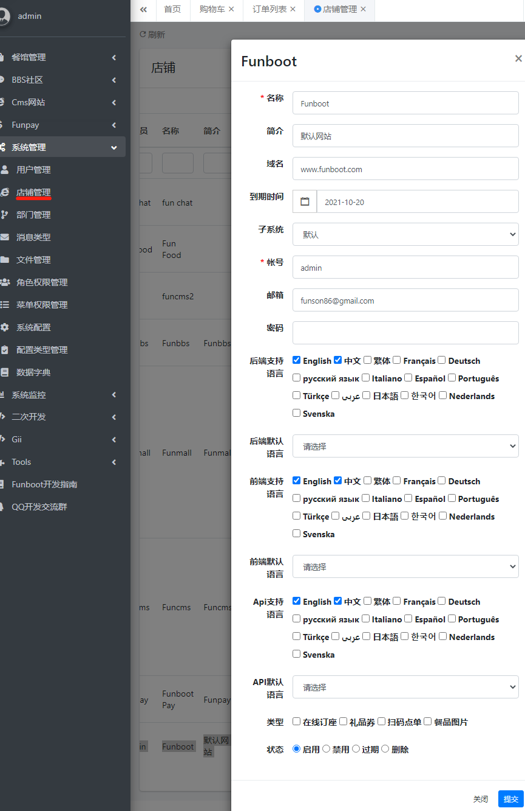

Installation
-------

Table of contents

- Requirement
- Installation
- System Setting
- System running
- FAQ


### Requirement

> Please view [Environment](start-env.md), Recomend [BT](https://www.bt.cn/) for startup quickly.

### Installation

1、Git clone repository, or download [Funboot Zip](https://github.com/funson86/funboot/archive/master.zip)

```
git clone https://github.com/funson86/funboot funboot
```

2、Change directory to funboot, change directory if downloaded zip file. 

```
cd funboot
```

3、Composer to install vendors.

```
composer install 
```

4、Init the project

``` 
php init // Enter 0 for develop mode, then enter yes and press enter again
```

5、Config database information (Mysql5.7.x, need create database first with utf8mb4 and utf8mb4_unicode_ci)

Edit in common/config/main-local.php 

``` 
        'db' => [
            'class' => 'yii\db\Connection',
            'dsn' => 'mysql:host=localhost;dbname=funboot',
            'username' => 'root',
            'password' => '',
            'charset' => 'utf8mb4',
            'tablePrefix' => 'fb_',
            // 'enableSchemaCache' => true, // 是否开启缓存, 请了解其中机制在开启，不了解谨慎
            // 'schemaCacheDuration' => 3600, // 缓存时间
            // 'schemaCache' => 'cache', // 缓存名称
        ],
```

6、Migrate data to database

``` 
php yii migrate/up
```

The command above migrate basic funboot data.

Other subsytem command below

```
php yii migrate-pay/up  // pay
php yii migrate-cms/up  // CMS
php yii migrate-bbs/up  // bbs
php yii migrate-mall/up  // mall
php yii migrate-chat/up  // chat room
```

### System Setting

> The config is in .htaccess file for Apache, The code below is for Nginx

Config the root directory to /path/to/funboot/web in Nginx, then config the rewrite

Refer to the config below

```
server
    {
        listen 80;
        server_name www.funboot.com;
        index index.html index.htm index.php default.html default.htm default.php;
        root  /path/to/funboot/web;
    
        # rewrite
        location / {
            # Redirect everything that isn't a real file to index.php
            try_files $uri $uri/ /index.php$is_args$args;
        }
        location /backend {
            try_files $uri $uri/ /backend/index.php$is_args$args;
        }
        location /api {
            try_files $uri $uri/ /api/index.php$is_args$args;
        }

        location ~ \.php$ {
            include fastcgi_params;
            fastcgi_param SCRIPT_FILENAME $document_root$fastcgi_script_name;
            fastcgi_pass 127.0.0.1:9000;
            #fastcgi_pass unix:/var/run/php5-fpm.sock;
            try_files $uri =404;
        }
    }
```

### System running

Edit the hosts file adding www.funboot.com to 127.0.0.1

Access the URL below in a browser(Chrome) to view the funboot website：

```
http://www.funboot.com/  frontend
http://www.funboot.com/backend  backend  username: admin pwd：123456
http://www.funboot.com/api api
```

> http://www.funboot.com/ default page is like yii2 default page. test Management -> System Setting -> Store to edit www.funboot.com subsystem to funpay in the backend. 
> Refresh the frontend then it chage to funpay like https://funpay.funboot.net/



### Crontab Shell & Scheduling

Some shell in script console/shell/ directory

- queue.sh  // listening queue
- mysqlbackup.sh // backup mysql database

Copy queue.sh to queue-local.sh then write queue-local.sh in crontab.

Scheduling:

```
/usr/bin/php /www/funboot/yii schedule/run --scheduleFile=/www/funboot/console/runtime/schedule/schedule.php  1>> /dev/null 2>&1
```

### FAQ

[FAQ](start-faq.md)


