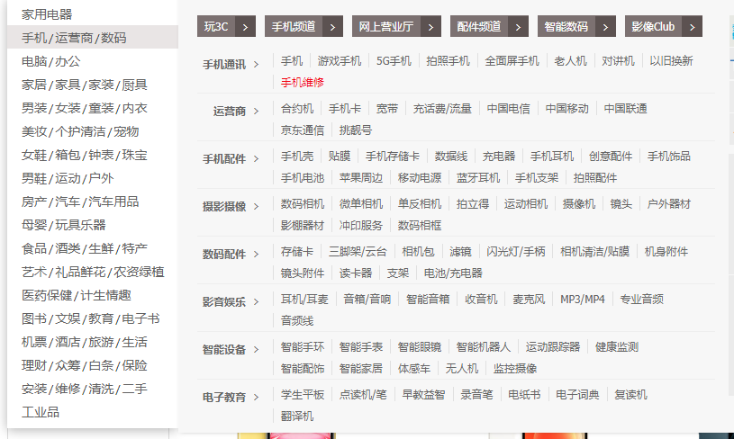

FunMall商城
-------

目录

- 列表中增加一个可编辑字段

> 测试帐号 https://mp.weixin.qq.com/debug/cgi-bin/sandboxinfo?action=showinfo&t=sandbox/index

> 在线接口调试：https://mp.weixin.qq.com/debug/cgi-bin/apiinfo

### 优化要点

- 缓存主页
- 搜索框动态滚动热搜词，跳转到搜索链接
- 热搜改成跳转到促销页面 （目前搜索框下面是热搜词）
- 如果二级分类少，直接显示在一级下面，分类右侧手动调整。如果一级二级分类多，二级分类和三级分类放右侧。目前测试数据使用前者方案

-  