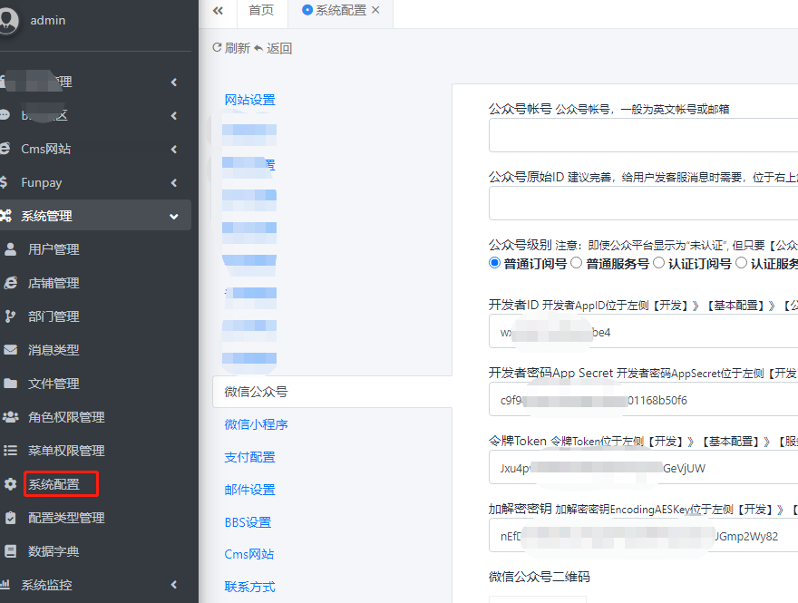
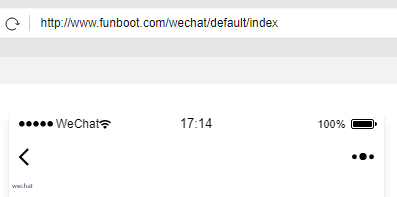
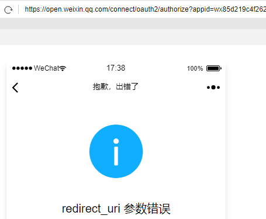
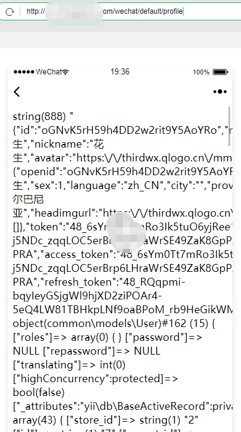
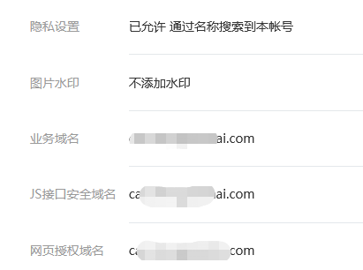

Webpage authorization 
------

wechat模块主要是演示微信中打开的网页发起登录授权，

### Prepare

在后台中设置相关wechat公众号相关参数



### 无需授权

继承frontend\modules\wechat\controllers\BaseController.php的controller可以在$optionalAuth中指定哪些action不需要指定

```php
    public $optionalAuth = ['index'];
```




### 微信公众号授权


在微信开发者工具中输入http://www.funboot.com/wechat/default/profile，会跳转到微信授权，类似地址https://open.weixin.qq.com/connect/oauth2/authorize?appid=wx85d219c4aa62dbe4&redirect_uri=http%3A%2F%2Fwww.funboot.com%2Fwechat%2Fdefault%2Fprofile&response_type=code&scope=snsapi_userinfo&state=95584dd8068b90a2b52d90373ad9cd58&connect_redirect=1&uin=MTcwODgwMTYw&key=a7858ea1085282199b1b3c65f2dfd3caf033fd6104b66e4641ac532e9bc74cb4ad087f3bf98bfef3020c51181e37165e&pass_ticket=/ZD01+geexZWAzy1Kv5JkDH5Xb+/T6Ddr/rwQlopANWzmlgyO41NjZhyA+1tZaDnyWPfiq7JMuPRnlxZ69KfYw==，



由于本地域名不在网页授权域名中，会提示参数错误，下面为放线上授权的截图




> 在公众号后台-》公众号设置-》功能设置-》网页授权域名  https://mp.weixin.qq.com/cgi-bin/settingpage?t=setting/function&action=function&token=753890179&lang=zh_CN




### 授权后动作

Override frontend\modules\wechat\controllers\BaseController.php的afterLogin()函数，比如插入到user表中。后续用户下单可以追溯是哪个用户下单。


### 集成到微信网页商城

参考frontend\modules\wechat\controllers\BaseController.php中的代码

1. use WechatLogin
2. 参考或者拷贝beforeAction函数中的代码
3. 覆盖afterLogin()函数，自定义动作
